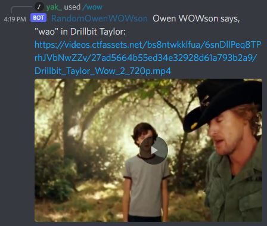
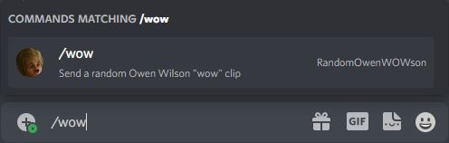

# random-owen-wowson

A Discord bot to send random Owen Wilson "wow" clips. Powered by the [Owen Wilson Wow API](https://owen-wilson-wow-api.herokuapp.com/). This bot is written using the [hikari](https://github.com/hikari-py/hikari) and [hikari-lightbulb](https://github.com/tandemdude/hikari-lightbulb) Python libraries for Discord. It features a small HTTPServer for checking the "up" status of the bot which is designed for use with free services where the bot needs to be "pinged" to keep it alive.




## Setup the bot

### 1. Get a Bot token

Follow this link, create a Discord app, create a Bot, and generate a Bot token:

[https://discord.com/developers/docs/getting-started#creating-an-app](https://discord.com/developers/docs/getting-started#creating-an-app)

### 2. Fork this repository

### 3. Install dependencies

`pip install -r requirements.txt`

### 4. Supply your Bot token

Create an `.env` file in the root directory and place your Discord Bot token in this file like so:

```
TOKEN=<discord_token>
```

## Run the bot

```
python bot.py
```

## Monitor the bot's status

A simple HTTP server is included to monitor the status of the bot on port 8000. Visit any route/page to [check if the bot is up](http://localhost:8000/status).
